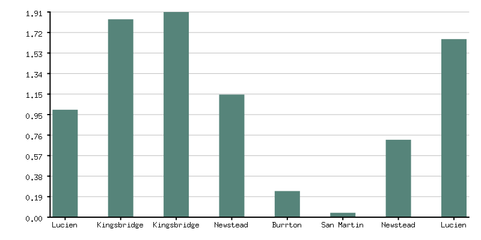
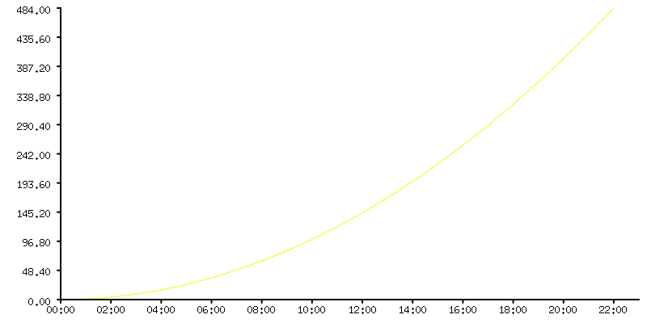
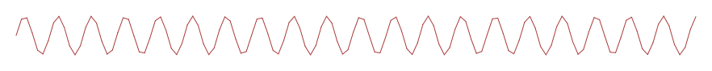

# Go Charts

Experimental pure go chart library for generating static charts.

WASM Demo: https://warmans.github.io/gochart/demo/

#### Barchart

[Code](examples/barchart/main.go)

#### Line/Timeseries
 

[Code](examples/timeseries/main.go)

#### Sparkline

[Code](examples/sparkline/main.go)